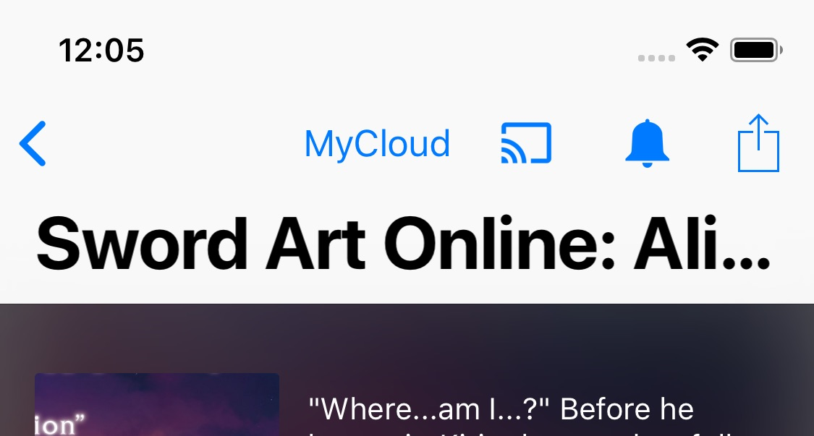
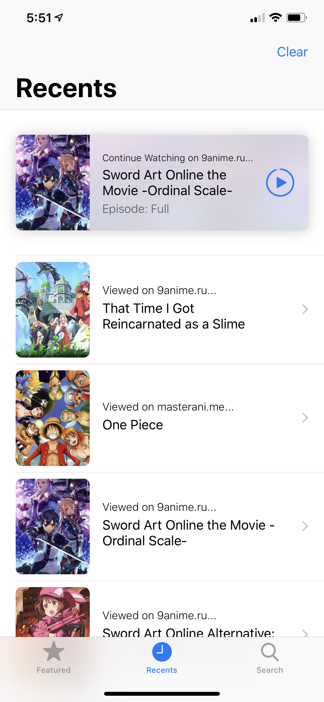
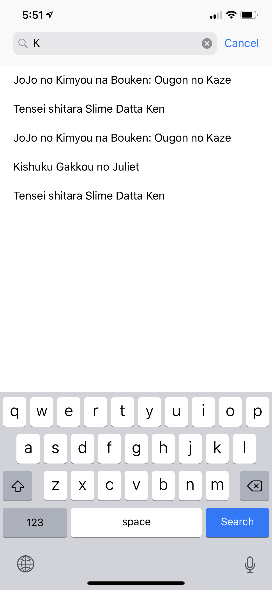
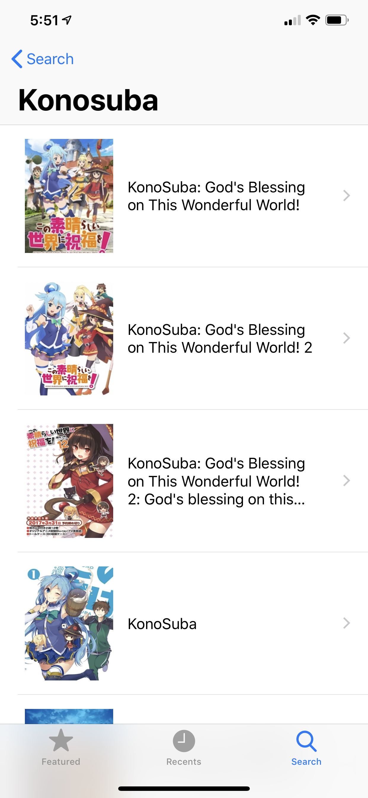
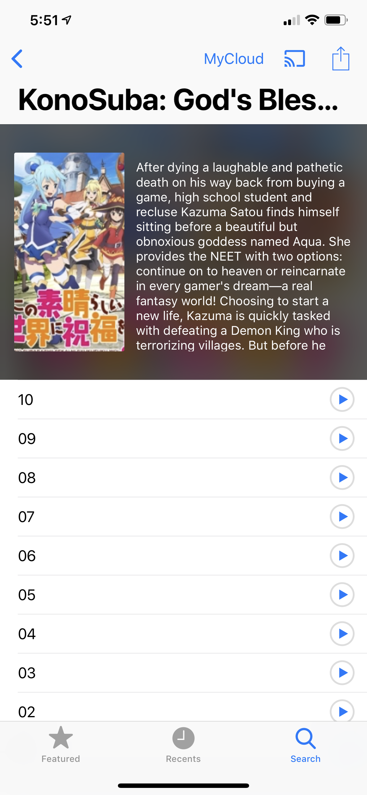
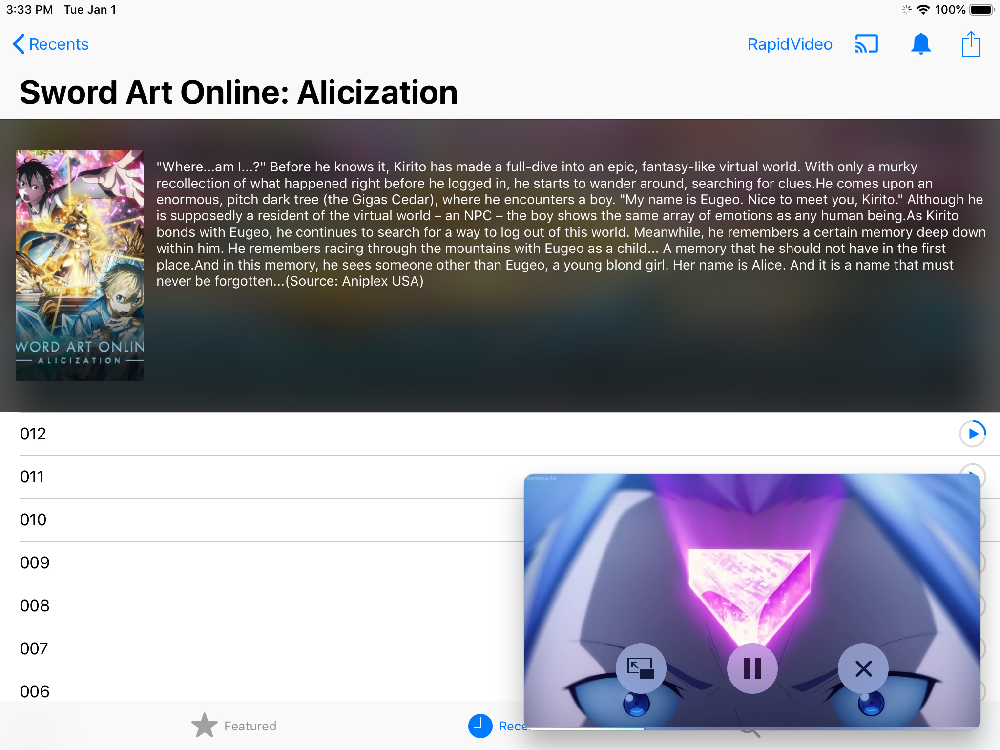

NineAnimator
==========

[](https://travis-ci.org/SuperMarcus/NineAnimator)
[](https://github.com/Carthage/Carthage)


[](/LICENSE)

A simple yet elegant way of waching anime on your favorite anime website.
NineAnimator is a free and open source anime watching app for iOS. Currently
it supports [9anime.ru](//9anime.ru) and [masterani.me](//masterani.me).
GPLv3 Licensed.

    
    Copyright © 2018 Marcus Zhou. All rights reserved.
    
    NineAnimator is free software: you can redistribute it and/or modify
    it under the terms of the GNU General Public License as published by
    the Free Software Foundation, either version 3 of the License, or
    (at your option) any later version.
    
    NineAnimator is distributed in the hope that it will be useful,
    but WITHOUT ANY WARRANTY; without even the implied warranty of
    MERCHANTABILITY or FITNESS FOR A PARTICULAR PURPOSE.  See the
    GNU General Public License for more details.
    
    You should have received a copy of the GNU General Public License
    along with NineAnimator.  If not, see <http://www.gnu.org/licenses/>.
    

## Table of Contents

- [Features](#features)
- [Build & Install](#build--install)
- [Google Cast](#google-cast)
- [Picture in Picture Playback](#picture-in-picture-playback)
- [Notifications & Subscription](#notifications--subscription)
- [Video Sources](#video-sources)
- [Screenshots](#screenshots)
- [Credits](#credits)

## Features

- [x] Ads Free and no logins
- [x] Super-duper clean UIs
- [x] Get notifications when new episodes come out
- [x] iOS's native video playback interface
- [x] Picture in Picture playback on iPads
- [x] Chromecast/Google Cast with lockscreen & control center support
- [x] Playback History & Auto Resumes
- [x] Support [9anime.ru](//9anime.ru) and [masterani.me](//masterani.me)
- [ ] Custom anime lists, e.g. favorites and to-watch list (planned)
- [ ] Integration with MAL (planned)

## Build & Install

### Step One: Install Carthage

To build this app, you will need [Carthage](https://github.com/Carthage/Carthage#installing-carthage) installed.

The simplest way to install Carthage is to use Homebrew.

```sh
$ brew update
$ brew install carthage
```

You can also install Carthage with the installer package, which can be found
[here](https://github.com/Carthage/Carthage/releases).

### Step Two: Build the app with Xcode

You won't need any Apple Developer membership to build and install this app.
Open this project in Xcode, connect your phone to the computer, select your
device, and click the run button on the top left corner.


Xcode might prompt you that the bundle identifier cannot be used. In this case,
select the `NineAnimator` in the Navigator, choose `NineAnimator` in the Targets,
click the `General` tab on the top, and change the `Bundle Identifier` in the
Identity section to whatever you like. Then, click the `Team` drawer in the Signing
section, and choose your developer profile. You should be good to go after this.

### Step Three (Optional): Update dependencies

All the required binaries have been compiled and uploaded to the repository, so
you shouldn't need to do this. But if something doesn't work out, you might want
to try updating the dependencies.

Still, you should make sure that you have a working copy of Carthage first.

```sh
$ carthage update
```

## Google Cast

NineAnimator supports playing back on both AirPlay (via iOS's native media player) and
Chromecast/Google Cast devices. However, not all of the video sources are supported
on Chromecast. Check [Video Sources](#video-sources) for details.

To use Google Cast in NineAnimator, tap on the Google Cast icon on the navigation bar.
A window will pop up to prompt you to select a playback device. Once the device is
connected, click "Done" and select an episode from the episode list. The video will
starts playing automatically on the Google Cast device.

The playback control interface will appear once the playback starts. You may use the
volume up/down buttons to adjust the volume.

To disconnect from a Google Cast device, tap on the Google Cast icon on the navigation
bar and tap the device that is already connected.

## Picture in Picture Playback

This feature is only supported on iPads.

The Picture in Picture (PiP) icon will appear on the top left corner of the player once PiP
is ready. You may tap on this icon to initiate PiP playback. To restore fullscreen playback,
tap the restore button on the PiP window.

## Notifications & Subscription

Subscribing anime in NineAnimator is implemented with iOS's Background Application
Refresh. NineAnimator will actively polls the available episodes and compares it with
locally cached episodes.


To subscribe an anime, swipe on the anime from left to right in the Recents tab.


Or simply tap on the bell icon when you are viewing any anime.



## Video Sources

Currently only a selection of video streaming hosts is supported by NineAnimator:

- RapidVideo
- Mp4Upload
- Streamango
- MyCloud (unavailable for Google Cast)
- Tiwi.Kiwi (may not be available for Google Cast)

More hosts may be added later. Feel free to open an issue to request additional hosts.

## Screenshots

| Featured Animes | Recently Viewed | Search |
| ------------------- | ------------------- | -------- |
|  |  |  |

| Search Results | Choose Episodes | Chromecast |
| ----------------- | -------------------- | --------------- |
|  |  |  |

| Featured Animes (iPad) | Picture in Picture (iPad) |
| ----------------- | -------------------- |
|  |  |

## Credits

* Thanks [ApolloZhu](https://github.com/ApolloZhu) for helping out!
* The free and open source chromecast library [OpenCastSwift](https://github.com/mhmiles/OpenCastSwift) (slightly [modified](https://github.com/SuperMarcus/OpenCastSwift)).
* The amazing [Alamofire](https://github.com/Alamofire/Alamofire) framework
* [onevcat](https://github.com/onevcat)'s couldn't-be-more-convenient [Kingfisher](https://github.com/onevcat/Kingfisher) framework
* ...and [scinfu](https://github.com/scinfu)'s awesome [SwiftSoup](https://github.com/scinfu/SwiftSoup)
