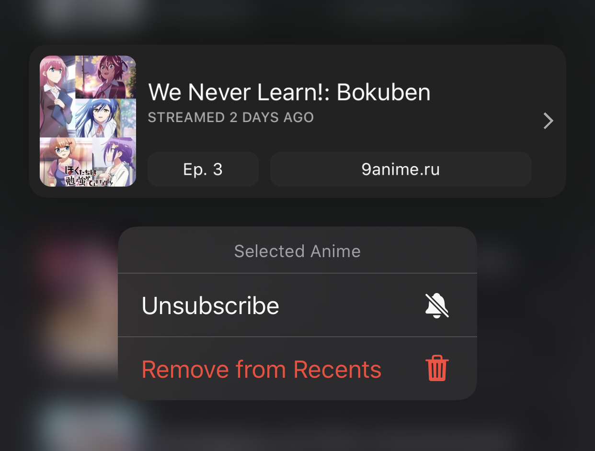
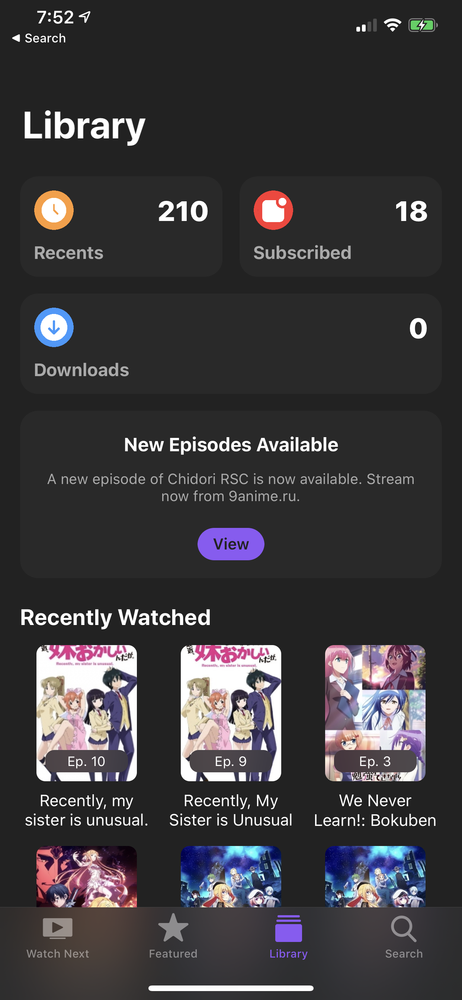
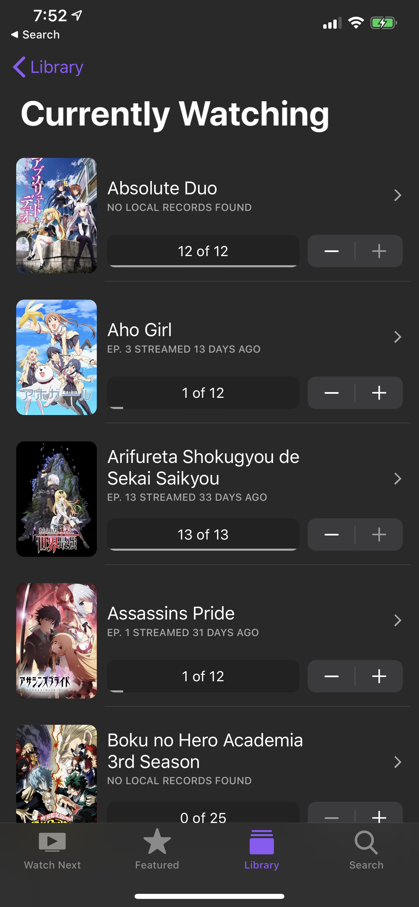
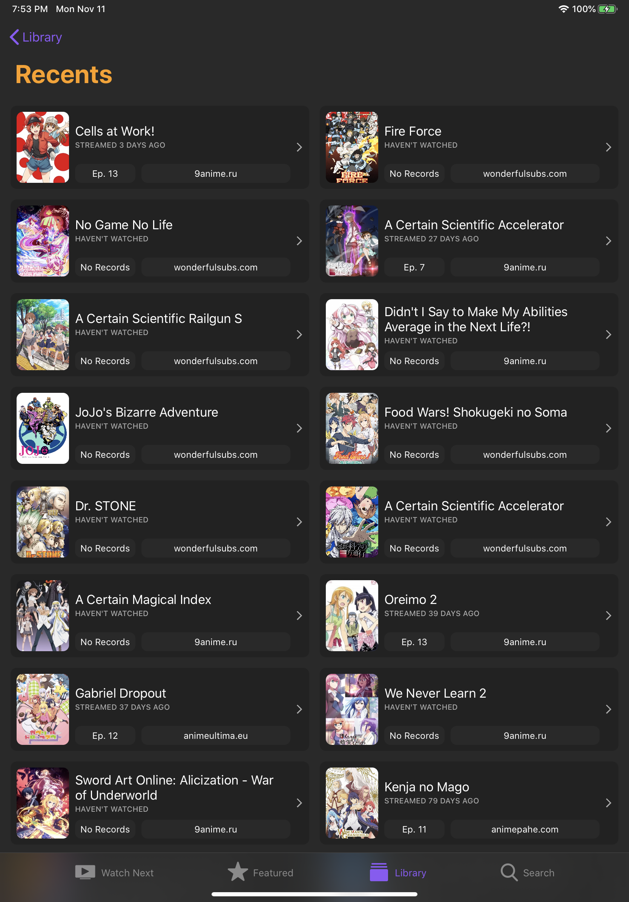
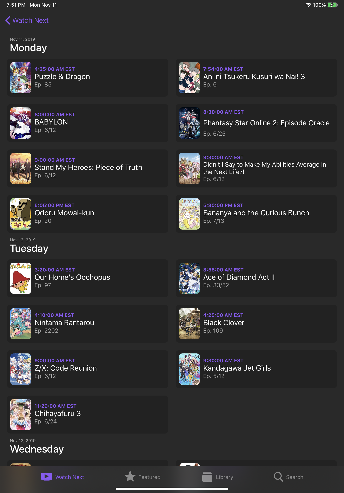
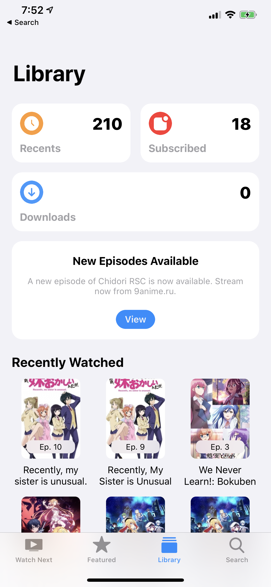
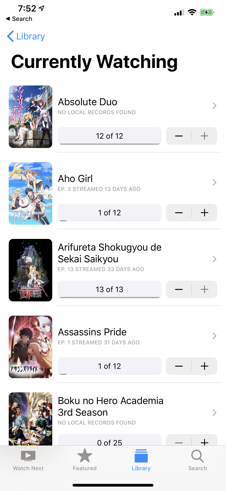
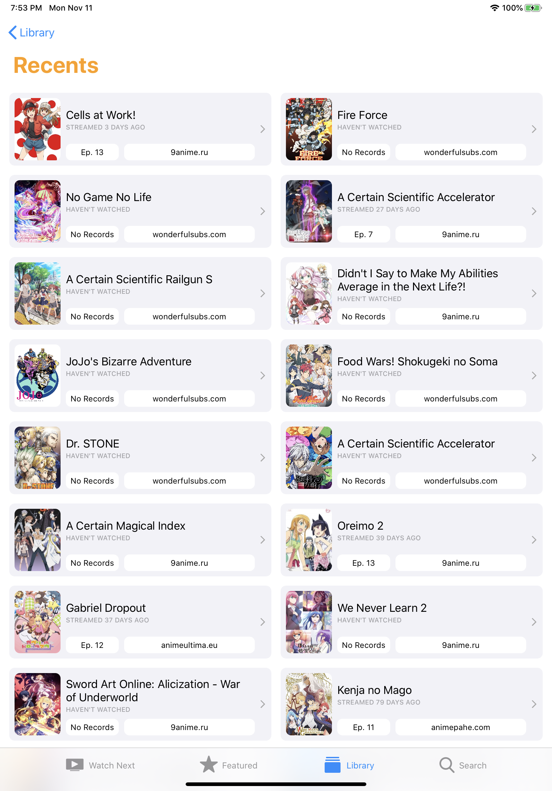
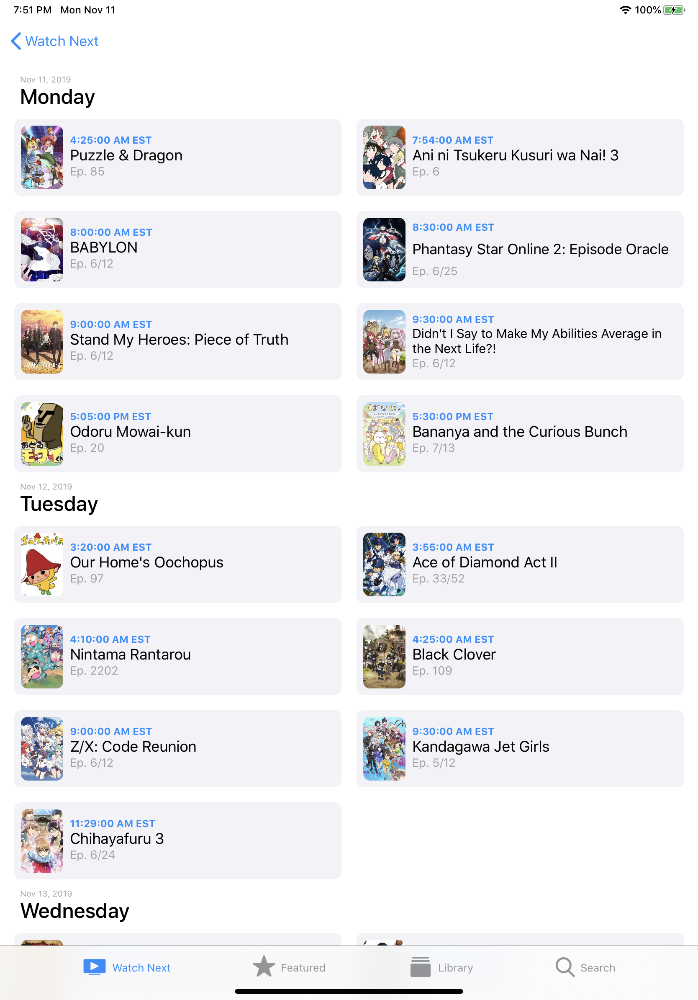

==========

    
    
    
    
    

    
    
    
    

A simple yet elegant way of waching anime on your favorite anime websites.
NineAnimator is a free and open source anime watching app for iOS and macOS. GPLv3 Licensed.

    
    Copyright © 2018-2020 Marcus Zhou. All rights reserved.
    
    NineAnimator is free software: you can redistribute it and/or modify
    it under the terms of the GNU General Public License as published by
    the Free Software Foundation, either version 3 of the License, or
    (at your option) any later version.
    
    NineAnimator is distributed in the hope that it will be useful,
    but WITHOUT ANY WARRANTY; without even the implied warranty of
    MERCHANTABILITY or FITNESS FOR A PARTICULAR PURPOSE.  See the
    GNU General Public License for more details.
    
    You should have received a copy of the GNU General Public License
    along with NineAnimator.  If not, see <http://www.gnu.org/licenses/>.
    

## Table of Contents

- [Features](#features)
- [Device Compatibility](docs/compatibility.md)
- [Installation](docs/installation.md)
- [Supported Sources](docs/supported-sources.md)
- [Third-Party Anime Lists](docs/third-party-lists.md)
- [Google Cast](#google-cast)
- [Picture in Picture Playback](#picture-in-picture-playback)
- [Notifications & Subscription](#notifications--subscription)
- [Smart Home Integration](#smart-home-integration)
- [Handoff & Siri Shortcuts](#handoff--siri-shortcuts)
- [Backup History and Playback Progresses](#backup-history-and-playback-progresses)
- [Download Episodes](#download-episodes)
- [Screenshots](#screenshots)
- [Credits](docs/credits.md)
- [Contributing](docs/CONTRIBUTING.md)
- [Privacy Statements & Policy](docs/privacy-policy.md)
- [Advanced Configurations](docs/runtime.md)

## Features

- [x] Ads Free and no logins
- [x] Super-duper clean UIs + Dark Mode
- [x] Get notifications when new episodes come out
- [x] Apple's native video playback interface
- [x] Picture in Picture playback on iPads/iOS 14+ devices
- [x] Chromecast/Google Cast with lockscreen & control center support
- [x] Playback History & Auto Resumes
- [x] Support [Multiple Anime Websites](docs/supported-sources.md)
- [x] Integration with HomeKit
- [x] Discord Rich Presence integration (macOS only)
- [x] Handoff & Siri Shortcuts
- [x] Download & play episodes offline
- [x] Third party anime [listing & tracking websites](docs/third-party-lists.md) (view & edit)
- [ ] Custom anime lists, e.g. favorites and to-watch list (currently retrieved from tracking websites; mutations are work-in-progress)

## Google Cast

NineAnimator supports playing back on both AirPlay (via Apple's native media player) and
Chromecast/Google Cast devices. However, not all of the steaming sources are supported
on Chromecast. Check [Video Sources](docs/supported-sources.md) for details.

To use Google Cast in NineAnimator, tap on the Google Cast icon on the navigation bar.
A window will pop up to prompt you to select a playback device. Once the device is
connected, click "Done" and select an episode from the episode list. The video will
starts playing automatically on the Google Cast device.

The playback control interface will appear once the playback starts. You may use the
volume up/down buttons to adjust the volume.

To disconnect from a Google Cast device, tap on the Google Cast icon on the navigation
bar and tap the device that is already connected.

## Picture in Picture Playback

This feature is only supported on iPads, Macs, and iOS 14+ devices.

The Picture in Picture (PiP) icon will appear on the top left corner of the player once PiP
is ready. You may tap on this icon to initiate PiP playback. To restore fullscreen playback,
tap the restore button on the PiP window.

## Notifications & Subscription

Subscribing anime in NineAnimator is implemented with Apple's Background Application
Refresh. NineAnimator will actively poll the available episodes and compares it with
locally cached episodes.

To subscribe an anime, long press on the anime in the Recents category of your Library.

Or simply tap on the subscribe button when you are viewing any anime.

## Smart Home Integration

NineAnimator can be configurated to run Home scenes when the playback starts and
ends. The default behavior is to only run the scenes when the video is playing on
external screens (e.g. Google Cast, AirPlay). However, you may change that in the
`Preference` -> `Home` panel.

- NineAnimator runs `Starts Playing` scene immediately after the video starts playing
- The `Ends Playing` scene will be performed 15 seconds before video playback ends

See [`Notifications`](/NineAnimator/Utilities/Notifications.swift) and
[`HomeController`](/NineAnimator/Controllers/HomeController.swift) for implementation
details.

## Handoff & Siri Shortcuts

NineAnimator supports Apple's handoff and Siri Shortcuts. This enables you to seemlessly
switch between devices when browsing and viewing anime.

When you browse an anime, depending on the device you are using, the NineAnimator icon
will show up on the dock (iPad) or the task switcher of your other devices. You may tap
on the icon to continue browsing or watching on the new device.

To add a siri shortcut, navigate to the system preferences app. Find NineAnimator under
the root menu, tap `Siri & Search`, then tap `Shortcuts`.

## Backup History and Playback Progresses

NineAnimator can export the recently watched anime list and the playback histories to
a `.naconfig` file. You may use this file to restore anime to the Recents tab or sync
progresses between devices.

Navigate to the preferences menu and tap on the `Export History`, a share menu
will pop up.

>
> Some updates of NineAnimator or improper operations may cause the anime under
> the Recents tab to disappear. Thus it is always a good habit to regularly backup
> the playback histories and progresses.
>

### Importing Modes

There are three ways to import a `.naconfig` file. When you open a `.naconfig`
file, NineAnimator will prompt you to choose one.

- `Replace Current`: Choosing this option will replace all local playback histories and progresses with the ones contained in the `.naconfig` file.
- `Merge - Pioritize Local`:  Choosing this option will merge the histories stored in the `.naconfig` file with local history. Local histories will be showed on top in the Recents tab. NineAnimator will prefer the local version of any data if it is present in both the importing `.naconfig` file and the local database.
- `Merge - Pioritize Importing`: Choosing this option will merge the histories stored in the `.naconfig` file with local history. The importing histories will be showed on top in the Recents tab. NineAnimator will prefer the importing version of any data if it is present in both the importing `.naconfig` file and the local database.

### `.naconfig` File

The `.naconfig` is essentially a binary, property list encoded dictionary with three
entries:

- `history`: A list of serialized `AnimeLink` objects from the recently watched tab.
- `progresses`: A dictionary keyed by the episode identifier for the persisted playback progresses.
- `exportedDate`: The `Date` that this file is generated.
- `trackingData`: A dictionary keyed by `AnimeLink` for the serialized `TrackingContext`.
- `subscriptions`: A list of serialized `AnimeLink` for your subscribed anime.

See [StatesSerialization.swift](NineAnimator/Utilities/StatesSerialization.swift) for
implementation details.

## Download Episodes

NineAnimator can download episodes for later playback. Tap on the cloud icon in the anime browser
to initiate download tasks. Downloaded episodes will appear in the Recents tab.

There are some limitations to NineAnimator's ability to download and playback videos:

- NineAnimator only supports downloading videos from a selection of [streaming sources](docs/supported-sources.md)
- Downloaded videos are only available to local playback. You may encounter problems playing offline episodes on AirPlay devices, and, if you are connected to a Google Cast device, NineAnimator will still attempt to fetch online resources for playback.

## Screenshots

### Dark Appearance

| Watch Next | Library | Search |
| ------------- | -------- | -------- |
|  |  |  |

| Edit Lists | Choose Episodes | Downloads |
| ----------- | -------------------- | --------------- |
|  |  |  |

| Recents Anime (iPad) | Picture in Picture (iPad) |
| ----------------- | -------------------- |
|  |  |

| Anime Information | Airing Schedule (iPad) |
| ----------------- | -------------------- |
|  |  |

### Light Appearance

| Watch Next | Library | Search |
| ------------- | -------- | -------- |
|  |  |  |

| Edit Lists | Choose Episodes | Downloads |
| ----------- | -------------------- | --------------- |
|  |  |  |

| Recents Anime (iPad) | Picture in Picture (iPad) |
| ----------------- | -------------------- |
|  |  |

| Anime Information | Airing Schedule (iPad) |
| ----------------- | -------------------- |
|  |  |

### Google Cast

| Cast Playback Control | Cast Playback Control (iPad) |
| ----------------- | -------------------- |
|  |  |
