==========

[](https://travis-ci.org/SuperMarcus/NineAnimator)
[](https://github.com/Carthage/Carthage)


[](/LICENSE)

A simple yet elegant way of waching anime on your favorite anime websites.
NineAnimator is a free and open source anime watching app for iOS. GPLv3 Licensed.

    
    Copyright © 2018-2019 Marcus Zhou. All rights reserved.
    
    NineAnimator is free software: you can redistribute it and/or modify
    it under the terms of the GNU General Public License as published by
    the Free Software Foundation, either version 3 of the License, or
    (at your option) any later version.
    
    NineAnimator is distributed in the hope that it will be useful,
    but WITHOUT ANY WARRANTY; without even the implied warranty of
    MERCHANTABILITY or FITNESS FOR A PARTICULAR PURPOSE.  See the
    GNU General Public License for more details.
    
    You should have received a copy of the GNU General Public License
    along with NineAnimator.  If not, see <http://www.gnu.org/licenses/>.
    

## Table of Contents

- [Features](#features)
- [Device Compatibility](#device-compatibility)
- [Build & Install](#build--install)
- [Google Cast](#google-cast)
- [Picture in Picture Playback](#picture-in-picture-playback)
- [Notifications & Subscription](#notifications--subscription)
- [Smart Home Integration](#smart-home-integration)
- [Handoff & Siri Shortcuts](#handoff--siri-shortcuts)
- [Video Sources](#video-sources)
- [Anime Listing & Tracking Websites](#anime-listing--tracking-websites)
- [Backup History and Playback Progresses](#backup-history-and-playback-progresses)
- [Download Episodes](#download-episodes)
- [Screenshots](#screenshots)
- [Credits](#credits)

## Features

- [x] Ads Free and no logins
- [x] Super-duper clean UIs + Dark Mode
- [x] Get notifications when new episodes come out
- [x] iOS's native video playback interface
- [x] Picture in Picture playback on iPads
- [x] Chromecast/Google Cast with lockscreen & control center support
- [x] Playback History & Auto Resumes
- [x] Support [Multiple Anime Websites](#anime-websites)
- [x] Integration with HomeKit
- [x] Handoff & Siri Shortcuts
- [x] Download & play episodes offline
- [x] Third party anime [listing & tracking websites](#anime-listing--tracking-websites)
- [ ] Custom anime lists, e.g. favorites and to-watch list (currently retrieved from tracking websites; mutations are work-in-progress)

## Device Compatibility

NineAnimator is theoretically compatible with all iPhone and iPads running iOS
11.2 or later. However, the app is only tested on the following devices running
the latest operation systems:

- iPhone Xs Max
- iPhone X
- iPad 9.7-inch (2018)
- iPad Pro 11-inch (2018)

## Build & Install

### Step One: Install Carthage

To build this app, you will need [Carthage](https://github.com/Carthage/Carthage#installing-carthage) installed.

The simplest way to install Carthage is to use Homebrew.

```sh
$ brew update
$ brew install carthage
```

You can also install Carthage with the installer package, which can be found
[here](https://github.com/Carthage/Carthage/releases).

### Step Two: Build the app with Xcode

You won't need any Apple Developer membership to build and install this app.
Open this project in Xcode, connect your phone to the computer, select your
device, and click the run button on the top left corner.

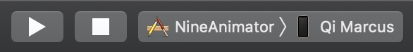

Xcode might prompt you that the bundle identifier cannot be used. In this case,
select the `NineAnimator` in the Navigator, choose `NineAnimator` in the Targets,
click the `General` tab on the top, and change the `Bundle Identifier` in the
Identity section to whatever you like. Then, click the `Team` drawer in the Signing
section, and choose your developer profile. You should be good to go after this.

### Step Three (Optional): Update dependencies

All the required binaries have been compiled and uploaded to the repository, so
you shouldn't need to do this. But if something doesn't work out, you might want
to try updating the dependencies.

Still, you should make sure that you have a working copy of Carthage first.

```sh
$ carthage update
```

## Google Cast

NineAnimator supports playing back on both AirPlay (via iOS's native media player) and
Chromecast/Google Cast devices. However, not all of the steaming sources are supported
on Chromecast. Check [Video Sources](#video-sources) for details.

To use Google Cast in NineAnimator, tap on the Google Cast icon on the navigation bar.
A window will pop up to prompt you to select a playback device. Once the device is
connected, click "Done" and select an episode from the episode list. The video will
starts playing automatically on the Google Cast device.

The playback control interface will appear once the playback starts. You may use the
volume up/down buttons to adjust the volume.

To disconnect from a Google Cast device, tap on the Google Cast icon on the navigation
bar and tap the device that is already connected.

## Picture in Picture Playback

This feature is only supported on iPads.

The Picture in Picture (PiP) icon will appear on the top left corner of the player once PiP
is ready. You may tap on this icon to initiate PiP playback. To restore fullscreen playback,
tap the restore button on the PiP window.

## Notifications & Subscription

Subscribing anime in NineAnimator is implemented with iOS's Background Application
Refresh. NineAnimator will actively polls the available episodes and compares it with
locally cached episodes.

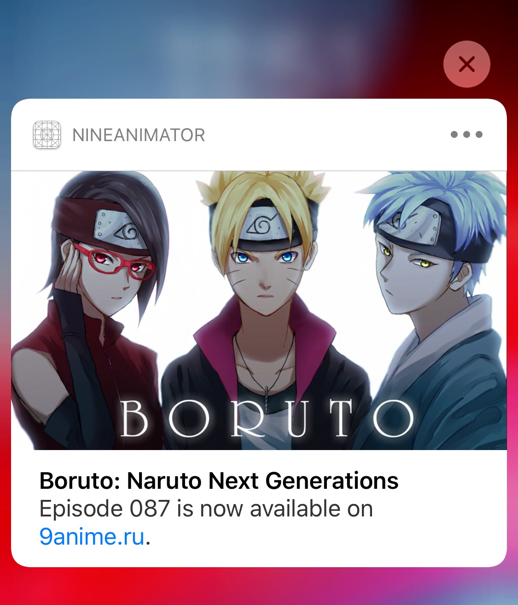

To subscribe an anime, swipe on the anime from left to right in the Recents tab.

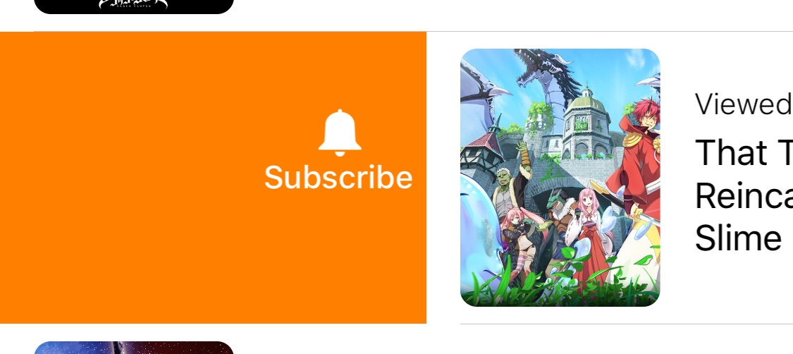

Or simply tap on the subscribe button when you are viewing any anime.

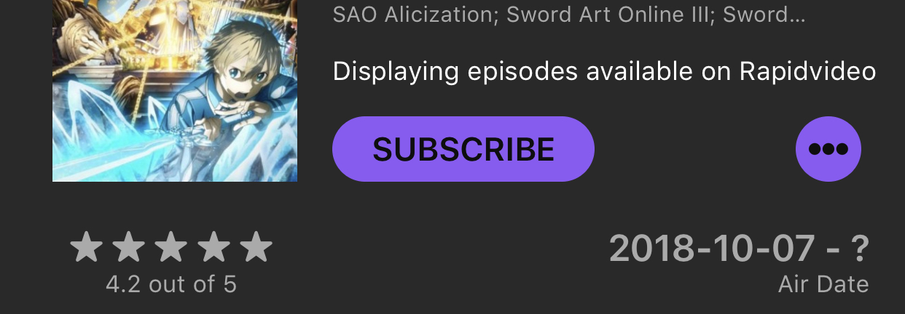

## Smart Home Integration

NineAnimator can be configurated to run Home scenes when the playback starts and
ends. The default behavior is to only run the scenes when the video is playing on
external screens (e.g. Google Cast, AirPlay). However, you may change that in the
`Preference` -> `Home` panel.

- NineAnimator runs `Starts Playing` scene immedietly after the video starts playing
- The `Ends Playing` scene will be performed 15 seconds before video playback ends

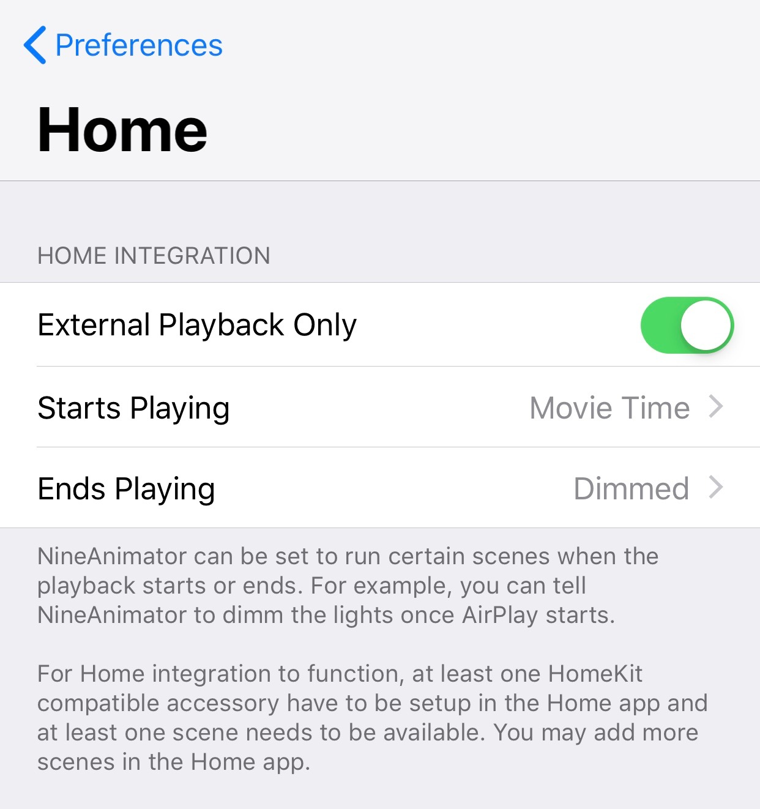

See [`Notifications`](/NineAnimator/Utilities/Notifications.swift) and
[`HomeController`](/NineAnimator/Controllers/HomeController.swift) for implementation
details.

## Handoff & Siri Shortcuts

NineAnimator supports iOS's handoff and Siri Shortcuts. This enables you to seemlessly
switch between devices when browsing and viewing anime.

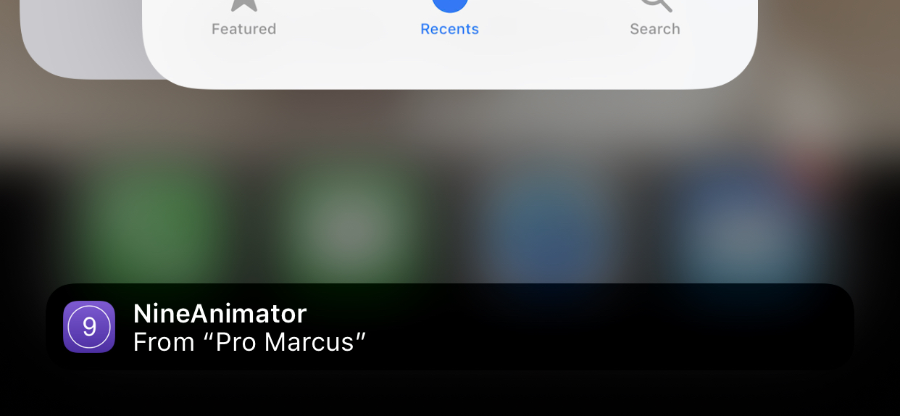

When you browse an anime, depending on the device you are using, NineAnimator icon
will show up on the dock (iPad) or the task switcher of your other devices. You may tap
on the icon to continue browsing or watching on the new device.

To add a siri shortcut, navigate to the system preferences app. Find NineAnimator under
the root menu, tap `Siri & Search`, then tap `Shortcuts`.

## Video Sources

### Streaming Sources

Currently only a selection of video streaming hosts is supported by NineAnimator:

- RapidVideo
- Mp4Upload
- Streamango
- MyCloud (unavailable for Google Cast)
- F5 Beta a.k.a. PrettyFast.to (unavailable for Google Cast)
- Tiwi.Kiwi (may not be available for Google Cast)
- FastStream
- AUEngine of Anime Ultima
- Self-hosted Streaming Services ([masterani.me](//masterani.me), [Anime Twist](//twist.moe)), as well as [Wonderful Subs](//wonderfulsubs.com)

All of the sources above support downloading. More hosts may be added later.
Feel free to open an issue to request additional hosts.

### Anime Websites

NineAnimator supports the following anime websites but with different sets
of features:

- [9anime.ru](//9anime.ru)
    - [x] Basic features (featured list, notifications, search, and playback)
    - [x] Open arbitrary links
    - [x] Anime synopsis
    - [x] Detailed anime attributes (Ratings and Air Date)
    - [ ] Detailed episode synopsis
- [Wonderful Subs](//wonderfulsubs.com)
    - [x] Basic features (featured list, notifications, search, and playback)
    - [x] Open arbitrary links
    - [x] Anime synopsis
    - [ ] Detailed anime attributes (Ratings and Air Date)
    - [x] Detailed episode synopsis
- [masterani.me](//masterani.me)
    - [x] Basic features (featured list, notifications, search, and playback)
    - [x] Open arbitrary links
    - [x] Anime synopsis
    - [x] Detailed anime attributes (Ratings and Air Date)
    - [x] Detailed episode synopsis
- [gogoanime.io](//gogoanime.io)
    - [x] Basic features (featured list, notifications, search, and playback)
    - [x] Open arbitrary links
    - [x] Anime synopsis
    - [ ] Detailed anime attributes (Only Air Date is available)
    - [ ] Detailed episode synopsis
- [Anime Twist](//twist.moe)
    - [x] Basic features (featured list, notifications, search, and playback; no anime artworks)
    - [ ] Open arbitrary links
    - [ ] Anime synopsis
    - [ ] Detailed anime attributes (Air Date is found but not displayed)
    - [ ] Detailed episode synopsis
- [Anime Ultima](//animeultima.eu)
    - [x] Basic features (featured list, notifications, search, and playback)
    - [ ] Open arbitrary links
    - [x] Anime synopsis
    - [ ] Detailed anime attributes (Only Air Date is available)
    - [x] Detailed episode synopsis (Air Date and Episode Name are available; no episode synopsis available)

## Anime Listing & Tracking Websites

>
> Third-party Listing & Tracking support is still being improved. As of now, NineAnimator can only
> present limited amount of information (among the data retrieved) with no review & rating
> capabilities. Later updates will bring support to those functions.
>

NineAnimator can present information on a selection of third party listing websites. You can configure
NineAnimator to push local playback history to those tracking services.

The tracking services can be configured in the `Preferences` menu, under the `Anime Tracking Services`
submenu in the `Data and Privacy` section.

Supported tracking/listing services and capabilities:

- [AniList.co](//anilist.co)
    - [x] Display detailed anime information
    - [x] Push local playback history to the remote service
    - [x] Retrieve remote anime state and anime collections
- [Kitsu.io](//kitsu.io)
    - [ ] Display detailed anime information
    - [x] Push local playback history to the remote service
    - [x] Retrieve remote anime state and anime collections
- [MyAnimeList](//myanimelist.net)
    - [x] Display detailed anime information
    - [x] Push local playback history to the remote service
    - [x] Retrieve remote anime state and anime collections

## Backup History and Playback Progresses

NineAnimator can export the recently watched anime list and the playback histories to
a `.naconfig` file. You may use this file to restore anime to the Recents tab or sync
progresses between devices.

Navigate to the preferences menu and tap on the `Export History`, a share menu
will pop up.

>
> Some updates of NineAnimator or improper operations may cause the anime under
> the Recents tab to disappear. Thus it is always a good habit to regularly backup
> the playback histories and progresses.
>

### Importing Modes

There are three ways to import a `.naconfig` file. When you open a `.naconfig`
file, NineAnimator will prompt you to choose one.

- `Replace Current`: Choosing this option will replace all local playback histories and progresses with the ones contained in the `.naconfig` file.
- `Merge - Pioritize Local`:  Choosing this option will merge the histories stored in the `.naconfig` file with local history. Local histories will be showed on top in the Recents tab. NineAnimator will prefer the local version of any data if it is present in both the importing `.naconfig` file and the local database.
- `Merge - Pioritize Importing`: Choosing this option will merge the histories stored in the `.naconfig` file with local history. The importing histories will be showed on top in the Recents tab. NineAnimator will prefer the importing version of any data if it is present in both the importing `.naconfig` file and the local database.

### `.naconfig` File

The `.naconfig` is essentially a binary, property list encoded dictionary with three
entries:

- `history`: A list of serialized `AnimeLink` objects from the recently watched tab.
- `progresses`: A dictionary keyed by the episode identifier for the persisted playback progresses.
- `exportedDate`: The `Date` that this file is generated.

See [StatesSerialization.swift](NineAnimator/Utilities/StatesSerialization.swift) for
implementation details.

## Download Episodes

NineAnimator can download episodes for later playback. Tap on the cloud icon in the anime browser
to initiate download tasks. Downloaded episodes will appear in the Recents tab.

There are some limitations to NineAnimator's ability to download and playback videos:

- NineAnimator only supports downloading videos from a selection of [streaming sources](#video-sources)
- Downloaded videos are only available to local playback. You may encounter problems playing offline episodes on AirPlay devices, and, if you are connected to a Google Cast device, NineAnimator will still attempt to fetch online resources for playback.

## Screenshots

### Light Appearance

| Featured Animes | Recently Viewed | Search |
| ------------------- | ------------------- | -------- |
|  | 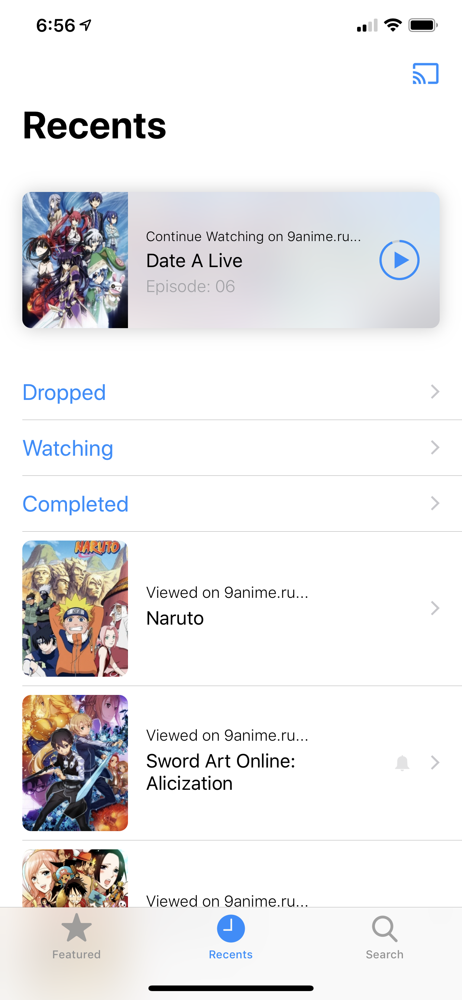 |  |

| Search Results | Choose Episodes | Downloads |
| ----------------- | -------------------- | --------------- |
|  | 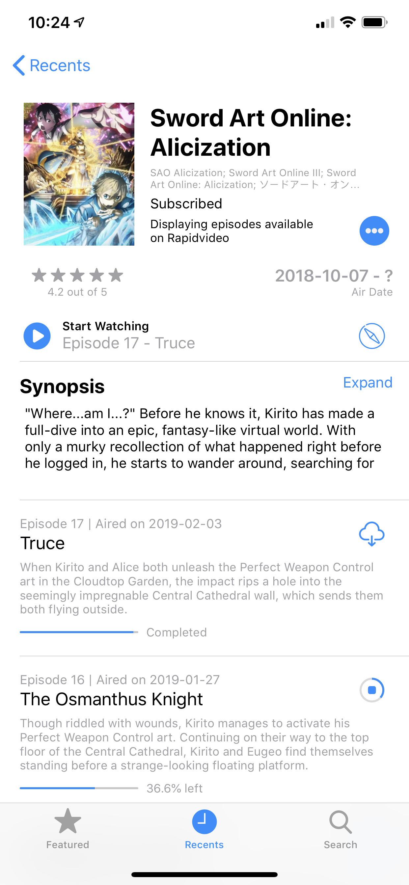 | 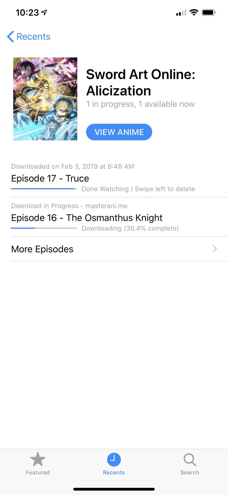 |

| Featured Animes (iPad) | Picture in Picture (iPad) |
| ----------------- | -------------------- |
|  | 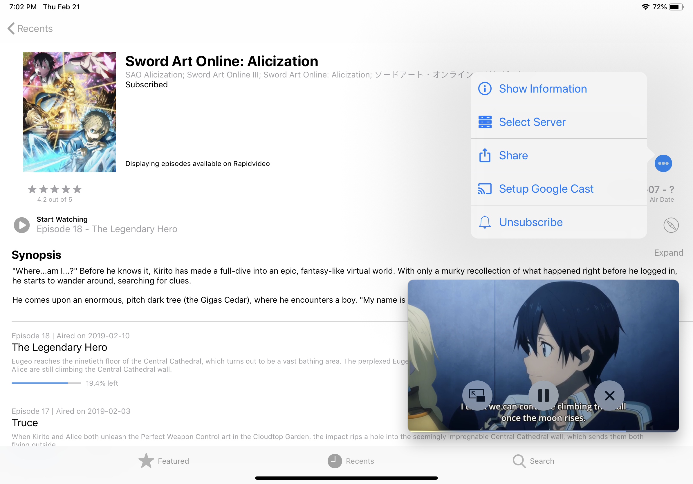 |

| Anime Information | Anime Information (iPad) |
| ----------------- | -------------------- |
|  |  |

### Dark Appearance

| Featured Animes | Recently Viewed | Search |
| ------------------- | ------------------- | -------- |
|  | 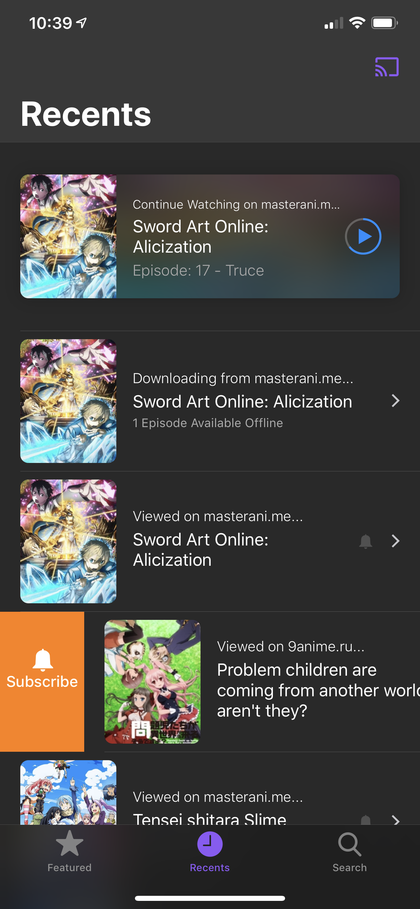 | 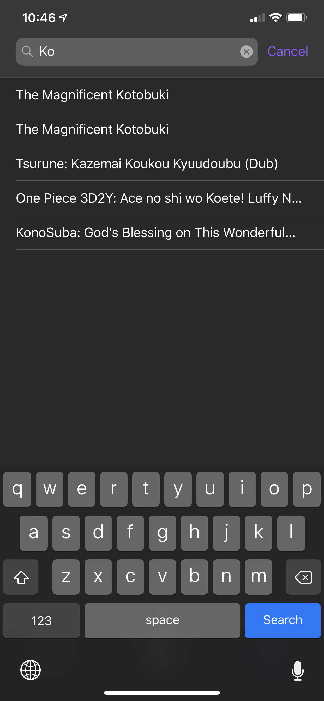 |

| Search Results | Choose Episodes | Downloads |
| ----------------- | -------------------- | --------------- |
| 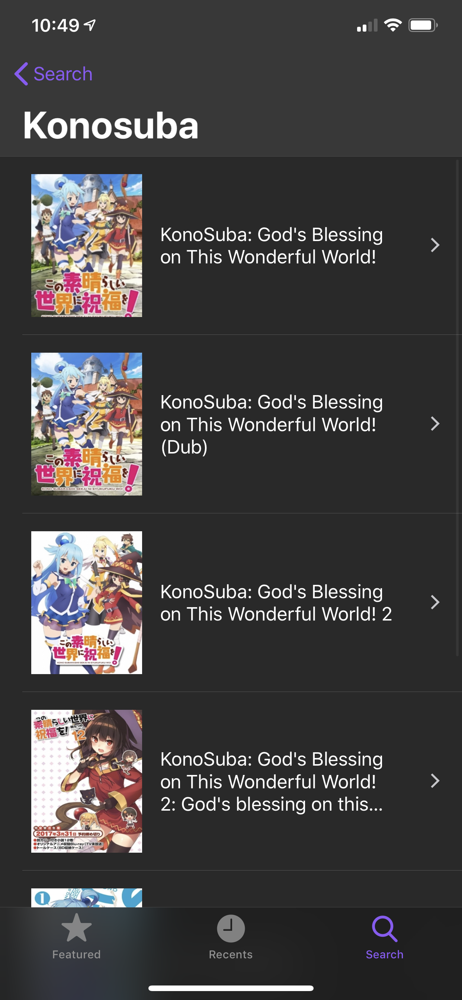 | 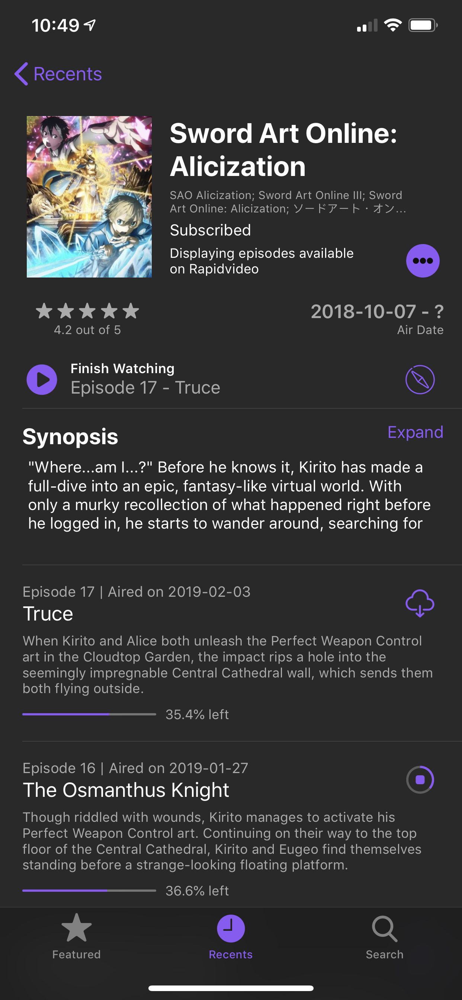 | 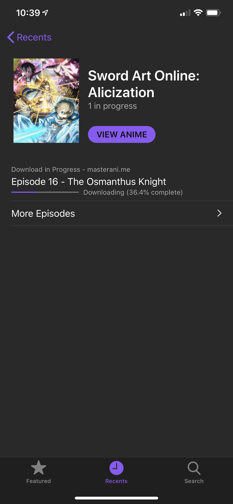 |

| Featured Animes (iPad) | Picture in Picture (iPad) |
| ----------------- | -------------------- |
|  | 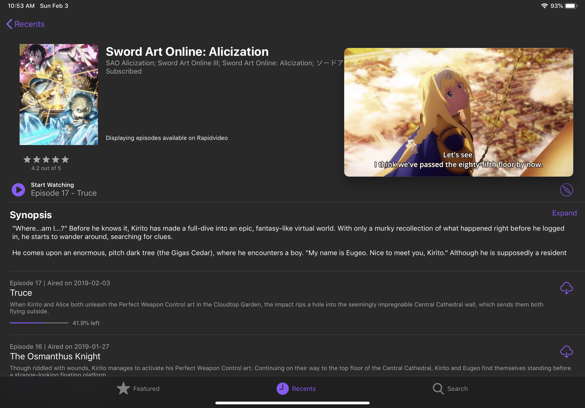 |

| Anime Information | Anime Information (iPad) |
| ----------------- | -------------------- |
|  |  |

### Google Cast

| Cast Playback Control | Cast Playback Control (iPad) |
| ----------------- | -------------------- |
| 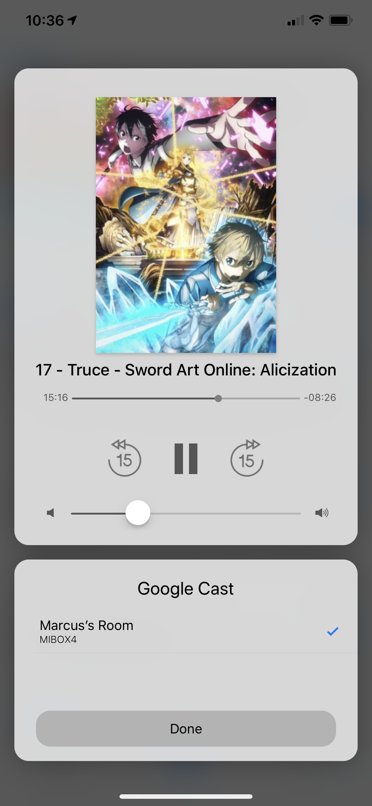 | 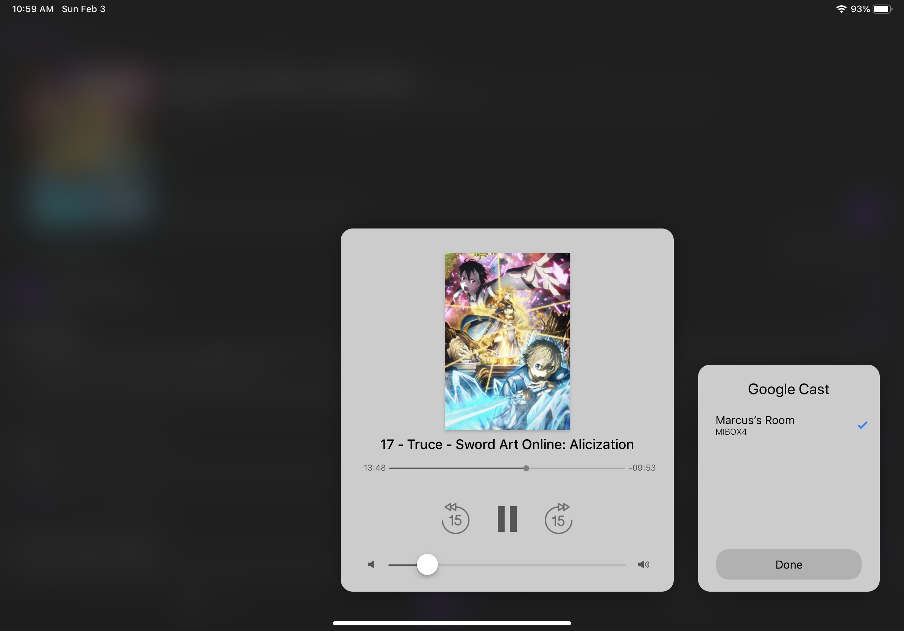 |

## Credits

* Thanks [ApolloZhu](https://github.com/ApolloZhu) for helping out!
* The free and open source chromecast library [OpenCastSwift](https://github.com/mhmiles/OpenCastSwift) (slightly [modified](https://github.com/SuperMarcus/OpenCastSwift)).
* The amazing [Alamofire](https://github.com/Alamofire/Alamofire) framework
* [onevcat](https://github.com/onevcat)'s couldn't-be-more-convenient [Kingfisher](https://github.com/onevcat/Kingfisher) framework
* ...and [scinfu](https://github.com/scinfu)'s awesome [SwiftSoup](https://github.com/scinfu/SwiftSoup)

### Media & Icons

Most of the resources are obtained from the open domains with their respective authors listed below.

- Cloud Download Icon by [Storm Icons](https://thenounproject.com/stormicons)
- [Google Cast Icon](https://commons.wikimedia.org/wiki/File:Chromecast_cast_button_icon.svg): uploaded to Wikimedia Commons by Y2kcrazyjoker4
- [Media Control Icons](https://icons8.com/icon/pack/media-controls/ios) from [Icons8](https://icons8.com/)
- [Details Icon](https://thenounproject.com/search/?q=detail&i=408469) by [Viktor Vorobyev](https://thenounproject.com/vityavorobyev/)
- [Action Icon](https://thenounproject.com/search/?q=share&i=1058858) by [Тимур Минвалеев](https://thenounproject.com/timur.minvaleev/)
- [Server Icon](https://thenounproject.com/search/?q=server&i=78508) by [Hans Paul Mösl Junior](https://thenounproject.com/hansmosl)
- [Solid Play Icon](https://thenounproject.com/search/?q=play&i=2184153) by [Eagle Eye](https://thenounproject.com/eagleeye)
- Anilist icon from [anilist.co](//anilist.co)
- Kitsu icon from [kitsu.io](//kitsu.io)
- MyAnimeList icon from [myanimelist.net](//myanimelist.net)
- [Information Icon](https://thenounproject.com/search/?q=information&i=1281664) by [Wawan Hermawan](https://thenounproject.com/wawan3)
