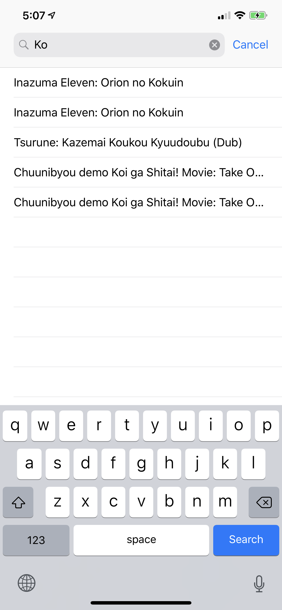
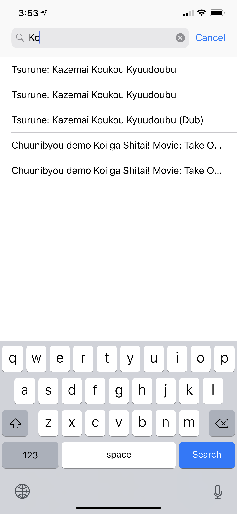
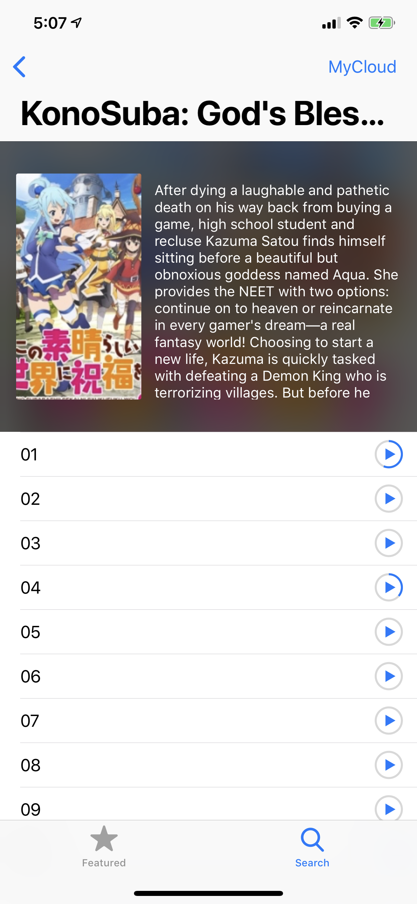

NineAnimator
==========

A simple yet elegant way of waching anime on your favorite anime website.
NineAnimator is an **unofficial** app of [9anime.to](//9anime.to) for iOS. GPL
v3 Licensed.

| Home Page  | Search | Search Results | Choose Episodes |
| -------------- | -------- | ------------------|----------------------|
|  |  |  |  |

    
    Copyright © 2018 Marcus Zhou. All rights reserved.
    
    NineAnimator is free software: you can redistribute it and/or modify
    it under the terms of the GNU General Public License as published by
    the Free Software Foundation, either version 3 of the License, or
    (at your option) any later version.
    
    NineAnimator is distributed in the hope that it will be useful,
    but WITHOUT ANY WARRANTY; without even the implied warranty of
    MERCHANTABILITY or FITNESS FOR A PARTICULAR PURPOSE.  See the
    GNU General Public License for more details.
    
    You should have received a copy of the GNU General Public License
    along with NineAnimator.  If not, see <http://www.gnu.org/licenses/>.
    

## Features

- [x] iOS's native video playback interface (works with RapidVideo, Streamango, and MyCloud -- more is coming)
- [x] Search animes on 9anime
- [x] Most popular animes on 9anime
- [x] Ads Free and no logins
- [x] Remembers and auto resumes your playback progress
- [ ] Custom anime lists, e.g. favorites and to-watch list (work in progress)
- [ ] Playback history (work in progress)
- [ ] Supports Chromecast/Google Cast (planned)

## Build & Install

You don't need any Apple Developer membership to build and install this app.
Just open this project in Xcode and hopefully you'll be allowed to install and
run NineAnimator on your phone.

To update dependencies, run `carthage update`

## Credits

* Thanks [ApolloZhu](https://github.com/ApolloZhu) for helping out!
* The amazing [Alamofire](https://github.com/Alamofire/Alamofire) framework
* [onevcat](https://github.com/onevcat)'s couldn't-be-more-convenient [Kingfisher](https://github.com/onevcat/Kingfisher) framework
* ...and [scinfu](https://github.com/scinfu)'s awesome [SwiftSoup](https://github.com/scinfu/SwiftSoup)
