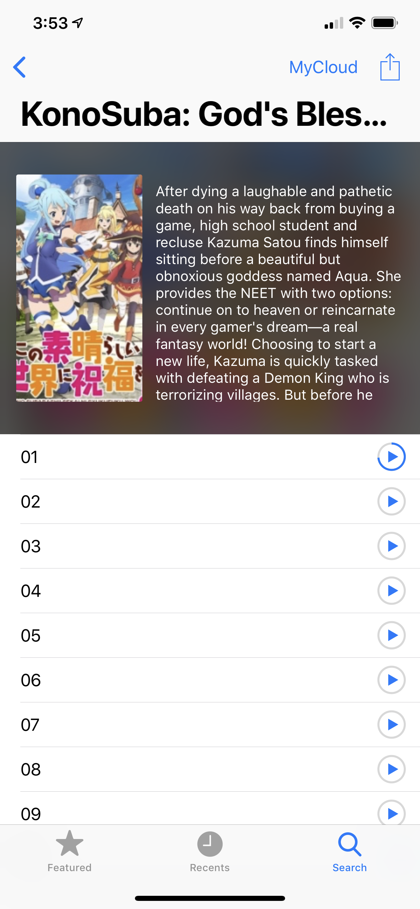
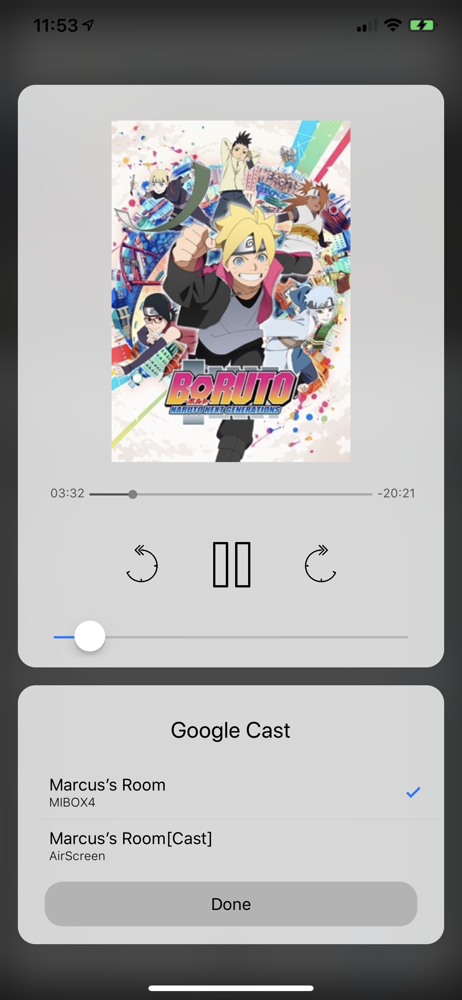

NineAnimator
==========

A simple yet elegant way of waching anime on your favorite anime website.
NineAnimator is an **unofficial** app of [9anime.to](//9anime.to) for iOS. GPL
v3 Licensed.

## Multi-sites support branch

This branch aims to support multiple anime streaming websites (along with
9anime) in the app.

Sites that will be supported
* [masterani.me](//masterani.me)

Sites that are being considered
* [eyeonanime.tv](//eyeonanime.tv)
* [animeheaven.eu](//animeheaven.eu)

| Featured Animes | Recently Viewed | Search |
| ------------------- | ------------------- | -------- |
|  |  |  |

| Search Results | Choose Episodes | Chromecast |
| ----------------- | -------------------- | --------------- |
|  |  |  |
    
    Copyright © 2018 Marcus Zhou. All rights reserved.
    
    NineAnimator is free software: you can redistribute it and/or modify
    it under the terms of the GNU General Public License as published by
    the Free Software Foundation, either version 3 of the License, or
    (at your option) any later version.
    
    NineAnimator is distributed in the hope that it will be useful,
    but WITHOUT ANY WARRANTY; without even the implied warranty of
    MERCHANTABILITY or FITNESS FOR A PARTICULAR PURPOSE.  See the
    GNU General Public License for more details.
    
    You should have received a copy of the GNU General Public License
    along with NineAnimator.  If not, see <http://www.gnu.org/licenses/>.
    

## Features

- [x] iOS's native video playback interface (works with RapidVideo, Streamango, and MyCloud -- more is coming), which also gives you the option to use AirPlay
- [x] Supports Chromecast/Google Cast (works with RapidVideo, Streamango. Doesn't work with MyCloud because of CORS)
- [x] Search animes on 9anime
- [x] Show the most popular/recent animes on 9anime
- [x] Ads Free and no logins
- [x] Auto resumes your playback progress
- [x] Playback history && resume playback with just one click in the Recent tab
- [x] Super-duper clean UIs
- [ ] Support sites other than 9anime (work in progress)
- [ ] Custom anime lists, e.g. favorites and to-watch list (work in progress)
- [ ] Integration with MAL (planned)

## Build & Install

### Step One: Install Carthage

To build this app, you will need [Carthage](https://github.com/Carthage/Carthage#installing-carthage) installed.

The simplest way to install Carthage is to use Homebrew.

```sh
$ brew update
$ brew install carthage
```

You can also install Carthage with the installer package, which can be found
[here](https://github.com/Carthage/Carthage/releases).

### Step Two: Build the app with Xcode

You won't need any Apple Developer membership to build and install this app.
Open this project in Xcode, connect your phone to the computer, select your
device, and click the run button on the top left corner.

Xcode might prompt you that the bundle identifier cannot be used. In this case,
select the `NineAnimator` in the Navigator, choose `NineAnimator` in the Targets,
click the `General` tab on the top, and change the `Bundle Identifier` in the
Identity section to whatever you like. Then, click the `Team` drawer in the Signing
section, and choose your developer profile. You should be good to go after this.

### Step Three (Optional): Update dependencies

All the required binaries have been compiled and uploaded to the repository, so
you shouldn't need to do this. But if something doesn't work out, you might want
to try updating the dependencies.

Still, you should make sure that you have a working copy of Carthage first.

```sh
$ carthage update
```

## Credits

* Thanks [ApolloZhu](https://github.com/ApolloZhu) for helping out!
* The amazing [Alamofire](https://github.com/Alamofire/Alamofire) framework
* [onevcat](https://github.com/onevcat)'s couldn't-be-more-convenient [Kingfisher](https://github.com/onevcat/Kingfisher) framework
* ...and [scinfu](https://github.com/scinfu)'s awesome [SwiftSoup](https://github.com/scinfu/SwiftSoup)
