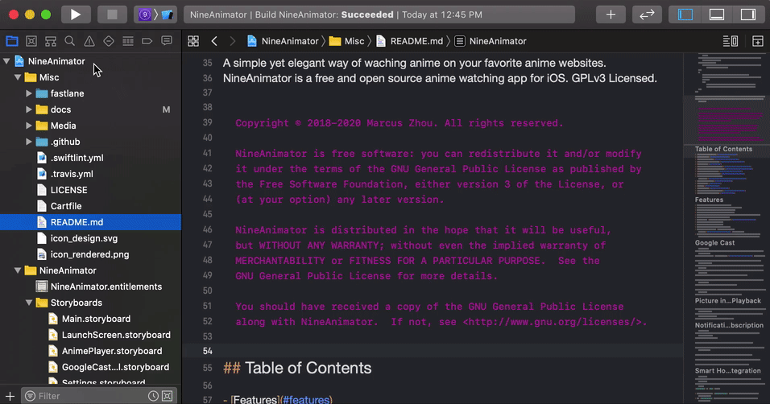

## Installation

To install NineAnimator on an iOS device, you have the following options:

- TestFlight Beta Testing
- AppStore
- NineAnimator AltStore Source (Beta)
- Legacy Methods
    - Install from Third-Party App Stores
    - Install via Cydia Impactor with Compiled IPAs
- For Contributors
    - Build from Source Code

## TestFlight Beta Testing

> [NineAnimator Beta Testing Program](https://testflight.apple.com/join/SzIVhF6w) is currently
> reaching full capacity. Join our [Discord server](https://discord.gg/dzTVzeW) for more information.

We're constantly adding supports for new websites and implementing additional features.
Join the [NineAnimator Beta Testing Program](https://testflight.apple.com/join/SzIVhF6w)
to be the first ones to try out those updates:
[https://testflight.apple.com/join/SzIVhF6w](https://testflight.apple.com/join/SzIVhF6w)

## AppStore

> Note: NineAnimator is currently unavailable on the App Store. Join our [Discord server](https://discord.gg/dzTVzeW) for more information.

[](https://apps.apple.com/app/nineanimator-the-anime-app/id1470033405)

~~NineAnimator is now available on the AppStore. We recommand you to install NineAnimator from the AppStore.~~

## NineAnimator AltStore Source (Beta)

> Note: NineAnimator's AltStore Source is an experimental service. Currently the version on the AltStore source is synchronized with the latest Github release.

* Source URL: `https://9ani.app/api/altstore`
* [Source Preview](https://altsource.by.lao.sb/browse/?source=https%3A%2F%2F9ani.app%2Fapi%2Faltstore)

## Legacy Methods

### Third-Party App Stores

NineAnimator is available on the following third-party app stores:

- [Ignition](//app.ignition.fun)
- [Build Store](//builds.io)

### Cydia Impactor

Download the latest compiled IPA file from the [release page](https://github.com/SuperMarcus/NineAnimator/releases/latest)
and install the app with Cydia Impactor.

For detailed instructions please view the **#installation** channel on our Discord server.

## For Contributors

### Build from Source Code

#### Step One: Install Carthage

To build this app, you will need to have the latest version of Xcode and
[Carthage](https://github.com/Carthage/Carthage#installing-carthage) installed.

The simplest way to install Carthage is to use Homebrew.

```sh
$ brew update
$ brew install carthage
```

You can also install Carthage with the installer package, which can be found
[here](https://github.com/Carthage/Carthage/releases).

#### Step Two (Optional): Update dependencies

All the required binaries have been compiled and uploaded to the repository, so
you shouldn't need to do this. But if something doesn't work out, you might want
to try updating the dependencies.

```sh
$ carthage update --platform iOS
```

#### Step Three: Modify Project Settings

This repository contains the code used for distribution. To build and sign the app,
you will need to modify the app's Bundle Identifier, Teams, and Capabilities.



1. Navigate to the `NineAnimator` project file.
2. Under the `General` tab, change part of the `Bundle Identifier` to any
    aphanumeric characters without whitespaces.
3. Then navigate to the `Signing & Capabilities` tab. Select your team in the
    `Teams` drawer. If Xcode prompts you for the signing options, choose the one that
    let Xcode automatically manages signing.
4. Scroll down in the `Signing & Capabilities` tab. Remove the associated
    domains capability.

When contributing, do not include your team identifier.

#### Step Four: Build the app with Xcode

You won't need any Apple Developer membership to build and install this app.
Open this project in Xcode, connect your phone to the computer, select your
device, and click the run button on the top left corner.


